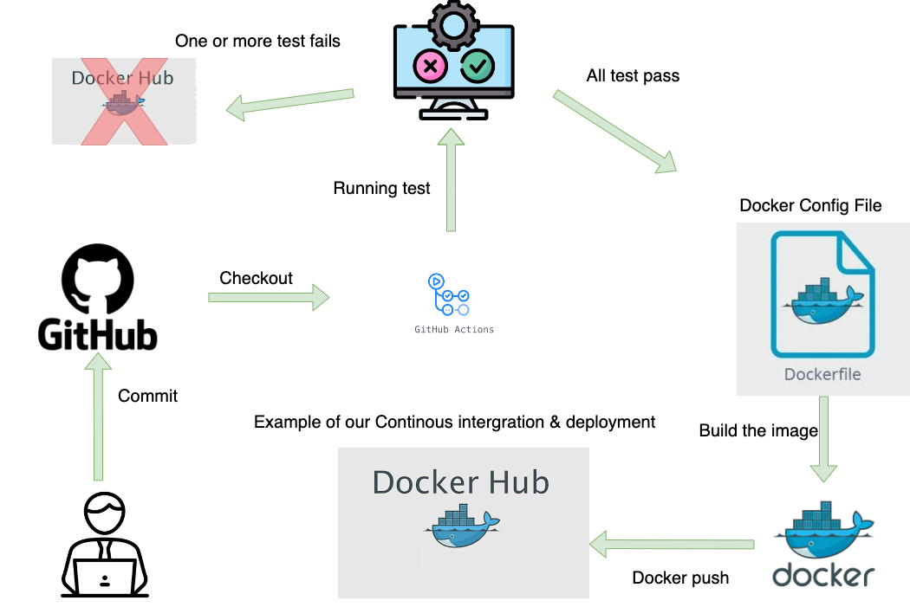

# Exam-mtgo

Team Members:
- Thomas - cph-ta181
- Markus - cph-ma587
- Rasmus - cph-rd92

## Table of Contents
- [Setup](#setup)
- [Microservices](#microservices)
- [Diagrams](#diagrams)
- [Legacy System](#legacy-system)
- [Pipeline](#pipeline)
- [Project Solution](#project-solution)

# Setup

1. Clone this project or download it as a zip and use it as the parent directory.

2. Clone the following projects into the parent directory.

3. Run the `docker-compose up -d` command from the parent directory.

# Microservices

- [Discovery Server](https://github.com/MRT-exam/exam-discovery-server)
- [API Gateway](https://github.com/MRT-exam/exam-api-gateway)
- [Order Service](https://github.com/MRT-exam/exam-order-service)
- [Restaurant Service](https://github.com/MRT-exam/exam-restaurant-service)
- [Delivery Service](https://github.com/MRT-exam/exam-delivery-service)
- [Notification Service](https://github.com/MRT-exam/exam-notification-service)

# Diagrams

- [Diagram & Design](#project-diagrams)
- [Domain Model](#domain-models)
- [C4 Model](#c4-model)
- [Other Diagrams](#other-diagram)

# Legacy System

# Pipeline

# Project Solution

