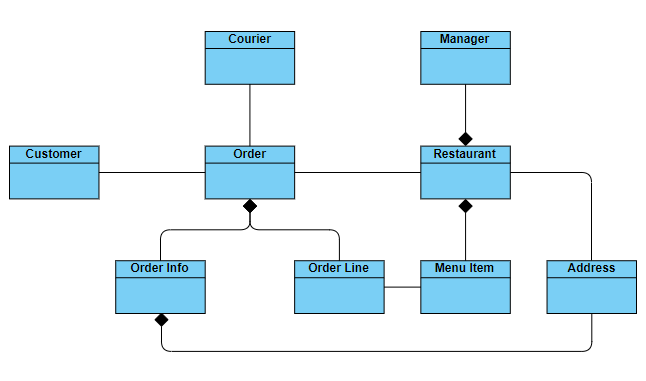
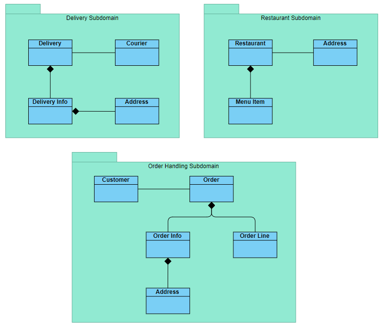
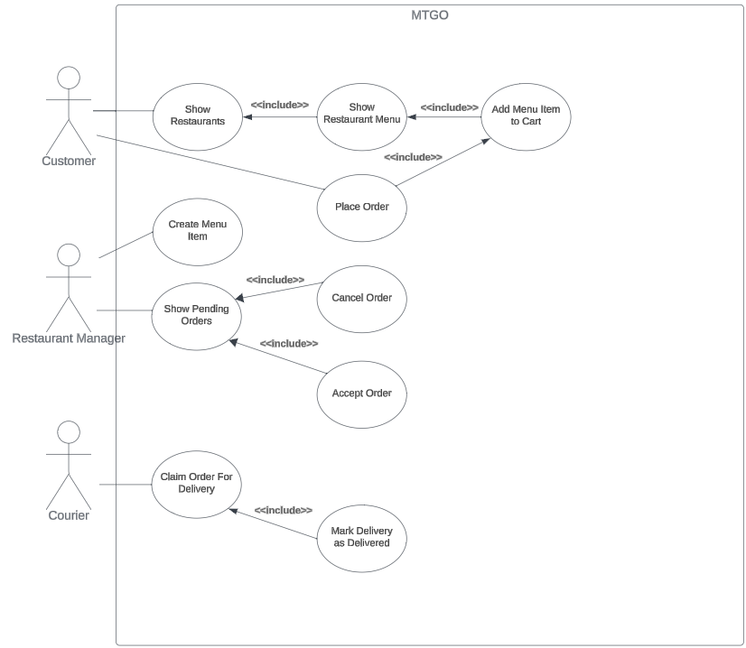
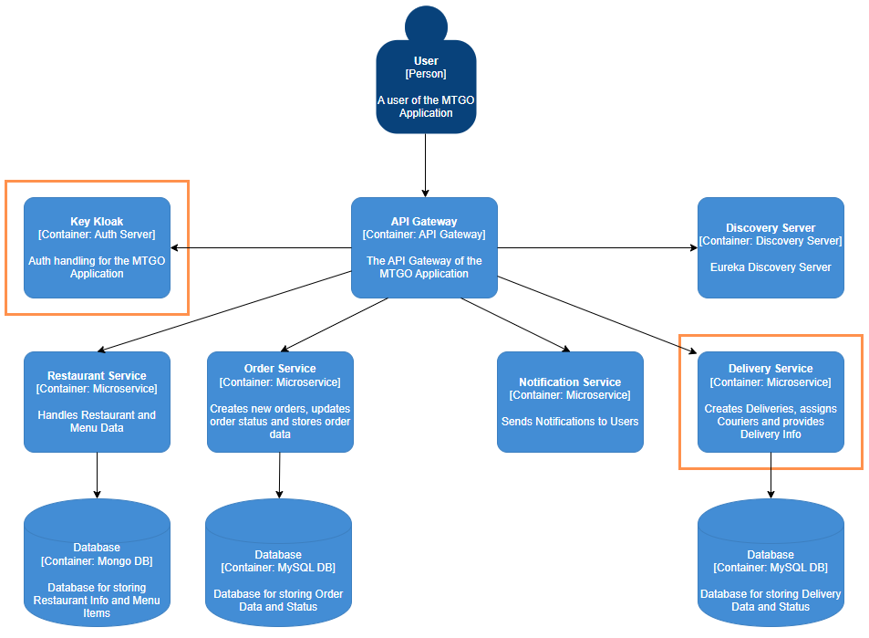
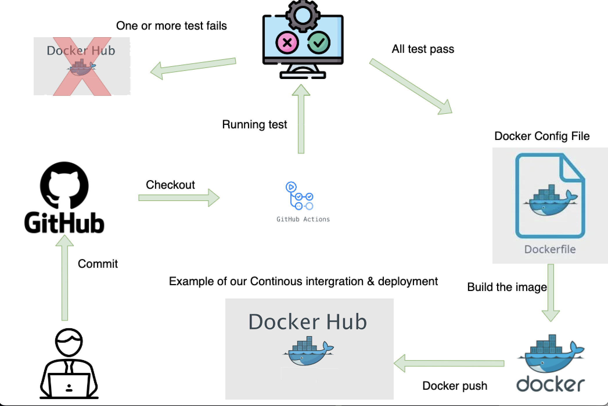

# Exam-mtgo

## Team Members:
- Thomas - cph-ta181@cphbusiness.dk
- Markus - cph-ma587@cphbusiness.dk
- Rasmus - cph-rd92@cphbusiness.dk

## Table of Contents
- [Setup](#setup)
- [Microservices](#microservices)
- [Project Description](#description)
- [Design](#design)
  - [User Stories](#user-stories)
  - [Use Case Diagram](#usecase-diagram)
  - [Domain Model](#domain-model)
  - [Subdomains](#subdomains)
  - [Architecture](#architecture)
  - [Other Diagrams](#other)
- [Legacy System](#legacy-system)
- [Pipeline](#pipeline)
  - [Dockerhub](#dockerhub)
- [Project Solution](#project-solution)

# Setup

1. Clone this project or download it as a zip and use it as the parent directory.

2. Clone the the repositories listed in [Microservices](#microservices) into (this) the parent directory.

3. Run the `docker-compose up -d` command from this directory.

# Microservices

- [Discovery Server](https://github.com/MRT-exam/exam-discovery-server)
- [API Gateway](https://github.com/MRT-exam/exam-api-gateway)
- [Order Service](https://github.com/MRT-exam/exam-order-service)
- [Restaurant Service](https://github.com/MRT-exam/exam-restaurant-service)
- [Delivery Service](https://github.com/MRT-exam/exam-delivery-service)
- [Notification Service](https://github.com/MRT-exam/exam-notification-service)

# Project Description  
This is a microservices project called MTGO (Mad To Go) which is used for ordering food from different restaurant.  
The solution utilizes Docker for containerizing each service and uses Euerka Discovery Server in collaboration with API-Gateway for scaling.  

### Restaurant Service  
Handles and provides Restaurant & Menu Item data.  

### Order Service  
Creates and stores new Orders while also handling Order Status updates.  

### Delivery Service  
Creates and stores new Deliveries while also assigning Couriers and registering Delivery Updates.  

### Notification Service  
Sends event-based notifications to relevant Users.  

# Design

## User Stories  
Some of the User Stories have been defined based on the assumption that there will be a GUI for the Customer to interact with. This will not implemented in this project, but some of the User Story definitions remain this way to ensure that the requirements are easy to understand.  

### US1 - Show Restaurants  
As a Customer, I want to see a list of Restaurants, so that I can select a Restaurant that I want to order
food from.  

“Given the Customer is on the [Main Page] of MTGO, when the Customer clicks the [Restaurants But-
ton], then a list of Restaurants will be displayed”.  

### US2 - Show Restaurant Menu  
As a Customer, I want to select a Restaurant and see its Menu, so that I can choose the Menu Items that I
want to order.  

*“Given the Customer is on the [Restaurants Page], when the Customer selects a Restaurant from the list,
then the selected Restaurant’s Menu will be displayed”.*

### US3 - Create Menu Item  
As a Restaurant Manager, I want to create a new Menu Item, so that I can expand the Menu.  

*“Given the Restaurant Manager is on the [Menu Page] and clicks the [New Menu Item Button], when
the Restaurant Manager fills in the required Menu Item fields and clicks the [Add to Menu Button], then the
new Menu Item is created”.*  

### US4 - Show Pending Orders  
As a Restaurant Manager, I want to see a list of Pending Orders, so that I can choose to Accept or Cancel
them.  

*“Given the Restaurant Manager is on the [Main Page] of MTGO, when the Restaurant Manager clicks
the [Orders Button], then a list of Orders (Canceled, Accepted and Pending) will be displayed”.*  

### US5 - Place Order  
As a Customer, I want to place an Order, so that I can notify the Restaurant about what Food I want
prepared and delivered.  

*“Given the Customer has selected at least 1 Menu Item and provided adequate customer info, when the
Customer places the Order, then the Order will be created with a PENDING status and a notification will be
sent to the Restaurant and Customer”.*  

### US6 - Accept Order  
As a Restaurant, I want to accept an Order, so that the Courier is able to claim accepted Orders for delivery.  

*“Given a Customer places an Order, when the Restaurant accepts the Order with status: PENDING, then
the Order will be updated with status: ACCEPTED” and a notification is sent to the Customer.*  

### US7 - Cancel Order  
As a Restaurant, I want to cancel an Order, so that I can notify the Customer that the Order has been
rejected and the Food won’t be prepared or delivered.  

*“Given a Customer places an Order, when the Restaurant cancels the Order with status: PENDING, then
the Order will be updated with status: CANCELED” and a notification is sent to the Customer.*  

### US8 - Claim Order For Delivery  
As a Courier, I want to claim an Order with status: ACCEPTED, so that a Delivery can be created and I
can deliver the food.  

*“Given there exist any Orders with status: ACCEPTED, when a Courier claims the Order for delivery,
then a Delivery will be created, the Order status will be updated to: CLAIMED and a notification will be sent
to the Customer”.*  

### US9 - Mark Delivery as Delivered  
As a Courier, I want to mark a Delivery as DELIVERED, so that I can inform the Restaurant and document
to the Customer that the delivery was successful.  

*“Given the Courier has claimed an Order for delivery, when the Courier marks the Delivery as DELIV-
ERED, then delivery status will be updated to: DELIVERED and a notification is sent to the Restaurant
and the Customer”.*  

## Domain Model  

### Subdomains

## Use Case Diagram  

## Architecture  

## Legacy System
To allow our users to view prices in other currencies we are using an external service/legacy System to get the current exchange rate.
The legacy system exposes a REST endpoint which we call including the currency which we wish to convert to.\
The REST call is made [Here](https://github.com/MRT-exam/exam-restaurant-service/blob/main/src/main/java/com/mtgo/exam/restaurantservice/service/RestaurantService.java)(Line 114)

## Pipeline
### Dockerhub: https://hub.docker.com/repositories/theagns

# Project Solution

